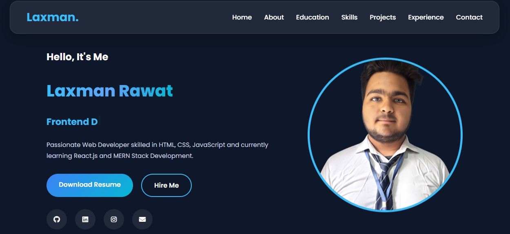

# 🌐 Laxman Rawat - Developer Portfolio

A modern, responsive, and interactive personal portfolio website built using **HTML, CSS, and JavaScript**. This portfolio showcases my skills, projects, education, internship, and contact information with a clean UI and smooth user experience.

---

## 🚀 Live Demo

🔗 https://your-portfolio-link.vercel.app/

---

## 📸 Preview



---

## ✨ Features

- 🌙 Dark & Light Theme
- 📱 Fully Responsive Design
- 🎯 Smooth Scroll Navigation
- ⚡ Scroll Reveal Animations
- ⌨️ Typed.js Text Animation
- 🎨 Glassmorphism UI Design
- 📂 Project Showcase Section
- 🖼️ Project Image Preview Modal
- 📄 Project Details Popup
- 📧 Working Contact Form (EmailJS)
- 🔔 Premium Toast Notifications
- ⏳ Send Message Loading Animation
- ⬆️ Back To Top Button
- 📥 Resume Download Button
- 🎭 Modern Hover Effects & Transitions

---

## 🛠️ Technologies Used

- HTML5
- CSS3
- JavaScript (ES6)
- Font Awesome
- Typed.js
- EmailJS

---

## 📂 Folder Structure

```text
Portfolio/
│
├── images/
├── resume/
├── style.css
├── projects.css
├── script.js
├── projects.js
├── index.html
└── README.md
```

---

## 💼 Sections

- Home
- About
- Education
- Skills
- Projects
- Experience
- Contact

---

## 📷 Screenshots

### Home


### Projects


### Contact


---

## 📧 Contact

**Laxman Rawat**

📩 Email: laxmanrawat9194@gmail.com

💼 LinkedIn:
https://linkedin.com/in/laxman-rawat-432682324

💻 GitHub:
https://github.com/Laxman43aa

🌍 Portfolio:
https://your-portfolio-link.vercel.app/

---

## 📜 License

This project is licensed under the MIT License.

---

## ⭐ Support

If you like this project, don't forget to give it a ⭐ on GitHub.
